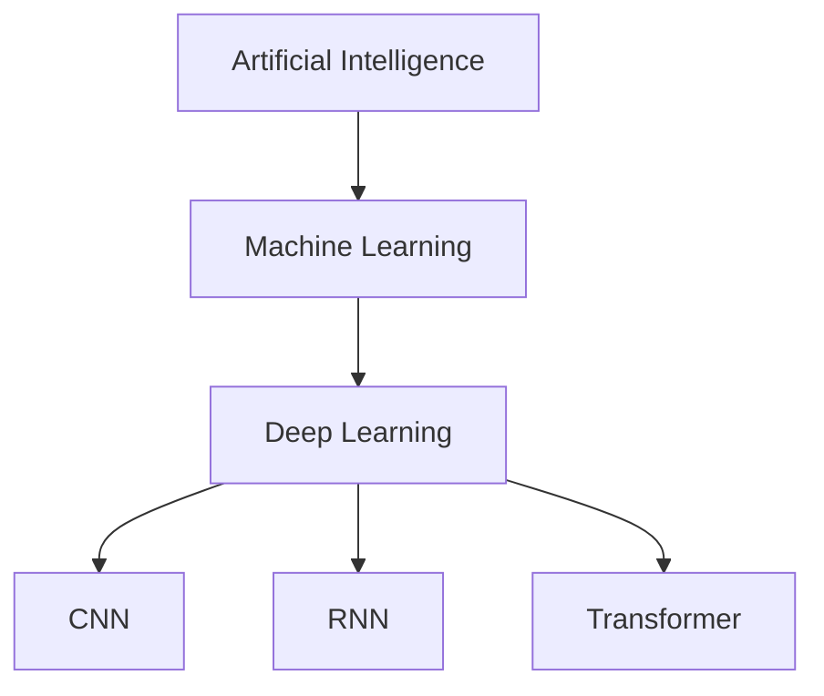

                    Artificial Intelligence
                            │
        ┌─────────────────────┴─────────────────────┐
        │                                           │
 Rule-Based Systems                                                     Machine Learning
                                                    │
                       ┌────────────────────────────┴─────────────────────────┐
                       │                                                                                                   │
              Traditional ML                                                                                      Deep Learning
                       │                                                                                                   │
        Manual Feature Engineering                                                     Automatic Feature Learning
# What is Deep Learning?

> **Definition**
>
> Deep Learning (DL) is a subset of Machine Learning that uses **Artificial Neural Networks (ANNs)** with **multiple hidden layers** to automatically learn complex patterns from data.

Instead of manually telling the computer which features are important, Deep Learning learns those features automatically.

---
> [!info] Definition
> Deep Learning is a subset of Machine Learning that uses deep neural networks with multiple hidden layers to automatically learn hierarchical representations from data.
# Evolution of AI

```text
Artificial Intelligence (AI)
│
├── Rule-Based Systems
│
└── Machine Learning (ML)
      │
      ├── Supervised Learning
      ├── Unsupervised Learning
      ├── Reinforcement Learning
      │
      └── Deep Learning (DL)
            │
            ├── ANN
            ├── CNN
            ├── RNN
            ├── LSTM
            ├── GRU
            ├── Transformer
            ├── Autoencoder
            └── GAN
```

---
> [!note]+ Deep Learning in One Sentence
>
> Deep Learning is the process of learning complex representations from data using multiple layers of interconnected neurons.
# Why is it called "Deep"?

A neural network becomes **deep** when it contains multiple hidden layers.

```text
Input
  │
  ▼
○ ○ ○ ○
  │
  ▼
Hidden Layer 1
● ● ● ● ●
  │
  ▼
Hidden Layer 2
● ● ● ● ●
  │
  ▼
Hidden Layer 3
● ● ● ● ●
  │
  ▼
Output
○ ○
```

> More hidden layers = Deeper Network

---

# Simple Analogy

Imagine teaching someone to identify a **cat**.

### Traditional Machine Learning

You manually tell the computer:

- Cats have ears
- Cats have whiskers
- Cats have tails
- Cats have fur

Computer learns from these manually designed features.

```text
Image
   │
   ▼
Feature Engineering
(Human)
   │
   ▼
Machine Learning Algorithm
   │
   ▼
Prediction
```

---
> [!quote]
>
> "Data is the new oil, but Deep Learning is the refinery."
### Deep Learning

You simply provide thousands of cat images.

The neural network automatically learns:

- edges
- curves
- eyes
- ears
- whiskers
- face
- entire cat

without manual feature engineering.

```text
Thousands of Images
          │
          ▼
 Deep Neural Network
          │
Automatically learns features
          │
          ▼
      Prediction
```

---

# Feature Learning Hierarchy

Deep Learning learns from simple patterns to complex patterns.

```text
Image

   │
   ▼

Edges

   │
   ▼

Corners

   │
   ▼

Textures

   │
   ▼

Shapes

   │
   ▼

Object Parts

   │
   ▼

Complete Object
```

Example

```text
Pixel
 ↓
Edge
 ↓
Eye
 ↓
Face
 ↓
Cat
```

This hierarchy is one of the biggest strengths of Deep Learning.

---
> [!quote]
>
> "The more data a Deep Learning model sees, the better representations it can learn."

# Mathematical View

Given input

\[
X
\]

Neural Network computes

\[
\hat y=f(X;W,b)
\]

where

- W = weights
- b = biases
- f = neural network

Training updates

\[
W=W-\eta\frac{\partial L}{\partial W}
\]

using

- Forward Propagation
- Loss Function
- Backpropagation
- Gradient Descent

---

# Deep Learning Pipeline

```text
Dataset
   │
   ▼
Data Preprocessing
   │
   ▼
Neural Network
   │
   ▼
Forward Propagation
   │
   ▼
Prediction
   │
   ▼
Loss Function
   │
   ▼
Backpropagation
   │
   ▼
Update Weights
   │
   ▼
Repeat
```

---

# Popular Deep Learning Models

| Model | Used For |
|---------|-----------|
| Perceptron | Binary Classification |
| MLP | Structured Data |
| CNN | Images |
| RNN | Sequential Data |
| LSTM | Long Sequences |
| GRU | Faster Sequence Learning |
| Transformer | NLP, LLMs |
| Autoencoder | Compression |
| GAN | Image Generation |
| Diffusion Models | AI Image Generation |

---

# Real-World Applications

## Computer Vision

- Face Recognition
- Medical Imaging
- Object Detection
- OCR
- Autonomous Cars

---

## Natural Language Processing

- ChatGPT
- Gemini
- Claude
- Translation
- Summarization
- Sentiment Analysis

---

## Speech

- Speech Recognition
- Voice Assistant
- Speaker Verification

---

## Recommendation Systems

- Netflix
- YouTube
- Spotify
- Amazon

---

## Healthcare

- Cancer Detection
- Drug Discovery
- MRI Analysis

---

# Advantages

- Automatic Feature Extraction
- Extremely High Accuracy
- Handles Huge Datasets
- Learns Complex Relationships
- State-of-the-Art Performance
- Works on Images, Audio, Text, Video

---

# Disadvantages

- Needs Large Dataset
- Requires GPU/TPU
- Computationally Expensive
- Difficult to Interpret
- Long Training Time

---

# Key Characteristics

- Learns features automatically
- Uses multiple hidden layers
- Requires lots of data
- Learns nonlinear relationships
- Optimized using Backpropagation
- Generalizes to unseen data

---

# Summary

```text
Deep Learning

↓

Subset of Machine Learning

↓

Uses Deep Neural Networks

↓

Learns Features Automatically

↓

Needs Large Data

↓

Needs High Computing Power

↓

Achieves State-of-the-Art Performance
```

---

# Interview Questions

### What is Deep Learning?

Deep Learning is a subset of Machine Learning that uses deep neural networks with multiple hidden layers to automatically learn hierarchical representations from data.

---

### Why is it called Deep?

Because the neural network contains multiple hidden layers.

---

### Why doesn't Deep Learning require feature engineering?

The network automatically extracts relevant features from raw data during training.

---

### What is the biggest advantage?

Automatic feature extraction and excellent performance on unstructured data.

---
