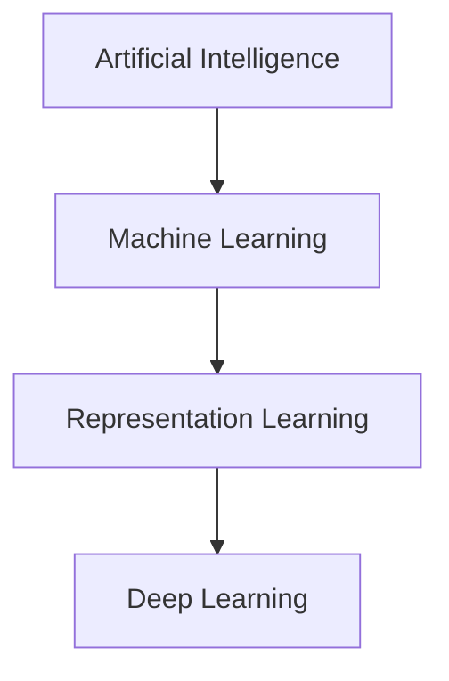

#  Representation Learning

> [!quote]
> *"The power of Deep Learning lies not in memorizing data, but in learning meaningful representations of it."*

---

#  Learning Objectives

After completing this note, you will understand:

- What Representation Learning is.
- Why it is one of the most important ideas in Deep Learning.
- Difference between Data, Features, and Representations.
- Why Machine Learning relied on handcrafted features.
- Why Deep Learning moved towards automatic feature learning.

---

#  The Big Picture



> [!important]
> **Representation Learning is the bridge between traditional Machine Learning and modern Deep Learning.**

---

#  What is Representation Learning?

> [!info] Definition
>
> **Representation Learning** is the process of automatically discovering useful and meaningful features (representations) from raw data so that a machine can perform tasks such as classification, regression, detection, or generation more effectively.

Instead of asking a human to decide **what information is important**, Representation Learning allows the model to **discover that information by itself**.

---

## A Simpler Definition

> [!tip]
> A **representation** is simply a new way of describing data so that a machine can understand it better.

Think of Representation Learning as **translating real-world information into a language that a computer can easily understand.**

---

#  Real-Life Analogy

Imagine you meet a person for the first time.

Initially, your brain receives only **raw information**.

```
Face
Voice
Hair
Height
Clothes
Expressions
```

After observing for a while, your brain starts building an internal understanding.

```
Friendly
Honest
Confident
Funny
Kind
```

Notice something interesting.

Your brain **didn't store every pixel of the person's face**.

Instead, it created a **compact representation**.

Deep Learning works in exactly the same way.

---

> [!success]
> Humans naturally learn representations.
>
> Deep Learning teaches machines to do the same.

---

#  What is a Representation?

Suppose we have an image.

```
📷 Dog Image
```

The computer initially sees only numbers.

```
[123, 98, 255,
 34, 87, 144,
 210, ...]
```

To us,

```
🐶 Dog
```

To a computer,

```
Matrix of Pixels
```

These raw pixel values are **not meaningful enough** for solving tasks.

The model must transform them into something useful.

```
Raw Pixels

↓

Edges

↓

Shapes

↓

Legs

↓

Face

↓

Dog
```

Each stage is called a **better representation**.

---

# Data → Features → Representations

This is perhaps the most important flow in Deep Learning.

```text
                    Raw Data
                       │
                       ▼
                  Feature Extraction
                       │
                       ▼
               Useful Representations
                       │
                       ▼
                 Machine Learning Task
```

---

## Step 1 — Raw Data

Raw data contains information but **not understanding**.

Examples:

| Domain | Raw Data |
|---------|----------|
| Image | Pixels |
| Text | Words |
| Audio | Sound Waves |
| Video | Frames |
| Sensor | Numerical Signals |

---

## Step 2 — Features

Features are measurable properties extracted from data.

Examples

For a house:

```
Area

Bedrooms

Bathrooms

Age

Location
```

For a person:

```
Height

Weight

Age

Income
```

For an image:

```
Edges

Corners

Textures

Shapes
```

---

> [!note]
> Features are **descriptive properties** of the original data.

---

## Step 3 — Representation

A representation is **an improved version of the original data** that preserves useful information while making learning easier.

Instead of remembering every pixel,

the network learns

```
Animal

↓

Dog

↓

Golden Retriever
```

This internal understanding is called the **representation**.

---

#  Why Do We Need Representation Learning?

Imagine building a cat detector.

Without Representation Learning, we must tell the computer:

```
Cats have

✔ Two ears

✔ Two eyes

✔ Whiskers

✔ Tail

✔ Fur
```

But what happens if

- the cat turns sideways?
- the lighting changes?
- the cat is sleeping?
- only half the face is visible?

Suddenly our manually designed rules start failing.

---

Deep Learning instead learns directly from examples.

```
Thousands of Cat Images

↓

Neural Network

↓

Learns Important Patterns

↓

Recognizes New Cats
```

---

> [!important]
> Representation Learning removes the need to manually specify every important feature.

---

#  Another Analogy

Imagine teaching someone to drive.

### Method 1

Give them a book containing

```
1000 Rules
```

They memorize everything.

---

### Method 2

Allow them to practice driving for months.

Eventually they develop intuition.

```
Road

↓

Experience

↓

Understanding

↓

Driving Skill
```

Deep Learning learns exactly like Method 2.

---

#  Human-Crafted vs Learned Representations

One of the biggest revolutions in AI was moving from **human-designed features** to **machine-learned representations**.

---

## Traditional Machine Learning

```text
Raw Data
     │
     ▼
Human Expert
     │
Feature Engineering
     │
     ▼
Machine Learning Model
     │
     ▼
Prediction
```

The engineer decides

- what features matter
- how to extract them
- how to represent data

The model only learns the mapping from features to outputs.

---

### Example

Suppose we want to detect spam emails.

Human engineers manually create features such as

```
Number of Links

Number of Capital Letters

Contains "FREE"

Contains "$$$"

Email Length
```

Then these features are fed into a machine learning algorithm.

---

> [!warning]
> If the handcrafted features are poor, even the best Machine Learning algorithm will perform poorly.

---

## Deep Learning

```text
Raw Data
     │
     ▼
Deep Neural Network
     │
Automatically Learns Features
     │
     ▼
Prediction
```

The engineer provides only

- Data
- Labels
- Model Architecture

The network learns the rest.

---

### Image Example

Instead of manually defining

```
Eyes

Nose

Tail

Fur
```

The network automatically discovers

```
Edges

↓

Corners

↓

Textures

↓

Eyes

↓

Face

↓

Cat
```

No manual feature engineering required.

---

#  Comparison

| Human-Crafted Features | Learned Representations |
|-------------------------|------------------------|
| Designed by humans | Learned automatically |
| Requires domain expertise | Learns directly from data |
| Limited flexibility | Highly flexible |
| Difficult to scale | Scales well with more data |
| Often task-specific | More generalizable |
| Used in Classical ML | Used in Deep Learning |

---

> [!example]
> **House Price Prediction**
>
> **Machine Learning:** Human selects area, rooms, age, and location as features.
>
> **Deep Learning:** If using images of houses, the network automatically learns representations such as architectural style, lighting, condition, roof shape, and other visual patterns without explicit feature engineering.

---

#  Key Takeaways

> [!summary]
>
> - Raw data is rarely suitable for learning directly.
> - Features describe important characteristics of data.
> - Representations are transformed versions of data that make learning easier.
> - Traditional Machine Learning depends heavily on handcrafted features.
> - Deep Learning automatically learns useful representations from raw data.
> - Representation Learning is the foundation of modern AI systems such as CNNs, Transformers, BERT, GPT, and diffusion models.

---

#  Interview Questions

<details>

<summary><strong>1. What is Representation Learning?</strong></summary>

Representation Learning is the process of automatically learning useful features or representations from raw data, eliminating much of the need for manual feature engineering.

</details>

---

<details>

<summary><strong>2. Why is Representation Learning important?</strong></summary>

Because it allows models to discover meaningful patterns directly from data, leading to better performance, scalability, and generalization across complex tasks.

</details>

---

<details>

<summary><strong>3. What is the difference between a feature and a representation?</strong></summary>

A feature is a measurable property of data (e.g., house area or image edges). A representation is an internal transformation of data learned by the model that captures the most useful information for a task.

</details>

---

#  Navigation

 [[What is Deep Learning]]

 [[Representation Learning (Part 2)]]

 [[Deep Learning Index]]