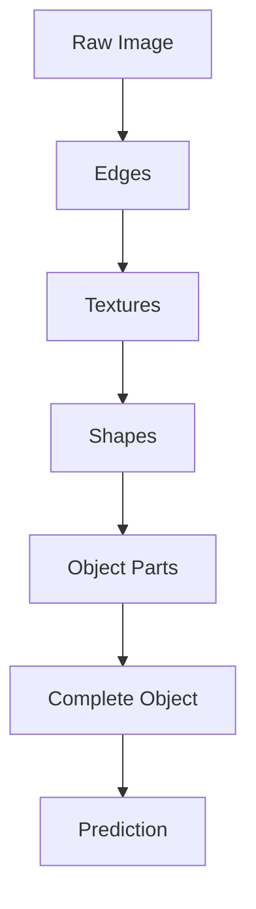

# Representation Learning (Part 2)

> [!quote]
> *"Deep Learning does not simply memorize data—it progressively transforms data into increasingly meaningful representations."*

---

# Learning Objectives

After completing this note, you will understand:

- What Hierarchical Feature Learning is.
- How neural networks build increasingly meaningful representations.
- Representation Learning in Machine Learning vs Deep Learning.
- Why Deep Learning performs exceptionally well on images, text, and speech.

---

# Recap

> [!summary]
>
> In Part 1, we learned:
>
> - Raw data is often difficult for machines to understand.
> - Features describe useful properties of data.
> - Representations are transformed versions of data that simplify learning.
> - Traditional Machine Learning relies on handcrafted features.
> - Deep Learning learns representations automatically.

---

# Hierarchical Feature Learning

> [!info]
>
> **Hierarchical Feature Learning** is the process of learning representations from simple concepts to increasingly complex concepts across multiple neural network layers.

Instead of trying to recognize an object in a single step, Deep Learning breaks the problem into many smaller steps.

Each layer learns something slightly more abstract than the previous layer.

---

# Why is it called "Hierarchical"?

Think about how humans recognize a face.

You don't immediately think,

```
This is Pradyumna.
```

Instead, your brain processes information in stages.

```text
Light

↓

Edges

↓

Shapes

↓

Eyes

↓

Face

↓

Identity
```

Deep neural networks work in exactly the same way.

---

# Hierarchical Learning in an Image

Suppose we want to recognize a cat.

The first layer never learns "cat."

Instead it learns something very simple.

```text
Layer 1

Edges
```

The next layer combines edges.

```text
Layer 2

Corners

Curves

Textures
```

The next layer combines these.

```text
Layer 3

Eyes

Nose

Whiskers

Ears
```

Finally,

```text
Layer 4

Entire Cat
```

---

# Complete Hierarchical Flow

```text
Raw Pixels

↓

Edges

↓

Corners

↓

Textures

↓

Object Parts

↓

Whole Object

↓

Prediction
```

---



---

> [!important]
>
> Every hidden layer learns a **better representation** than the previous layer.

---

# Example: Digit Recognition

Suppose we want to recognize the digit **8**.

The network gradually learns.

```text
Layer 1

Small Edges
```

↓

```text
Layer 2

Curves
```

↓

```text
Layer 3

Two Circles
```

↓

```text
Layer 4

Digit 8
```

Notice that no engineer explicitly programmed these steps.

The network discovered them automatically during training.

---

# Why Multiple Layers?

Imagine trying to build a house.

You cannot directly build the roof.

Instead,

```text
Foundation

↓

Walls

↓

Windows

↓

Roof
```

Similarly,

Deep Learning builds knowledge layer by layer.

---

# Representation Learning in Natural Language Processing

Consider the sentence

```
I love Deep Learning.
```

Initially,

the computer only sees words.

```
"I"

"love"

"Deep"

"Learning"
```

After Embedding Layer

```
[0.14, 0.82, -0.51, ...]
```

These numbers now contain semantic meaning.

Later layers learn

```text
Words

↓

Meaning

↓

Grammar

↓

Context

↓

Sentence Meaning
```

Finally,

the model understands

```
Positive Sentiment
```

---

# Representation Learning in Speech

Raw Audio

↓

Sound Waves

↓

Frequency Patterns

↓

Phonemes

↓

Words

↓

Sentences

↓

Meaning

---

# Representation Learning in Computer Vision

Raw Image

↓

Pixels

↓

Edges

↓

Textures

↓

Shapes

↓

Objects

↓

Scene Understanding

---

# Representation Learning in Machine Learning vs Deep Learning

One of the biggest differences between Classical Machine Learning and Deep Learning is **who creates the representation.**

---

## Classical Machine Learning

```text
Raw Data

↓

Human Expert

↓

Feature Engineering

↓

Machine Learning Algorithm

↓

Prediction
```

Human knowledge is essential.

Examples

Spam Detection

```
Contains "FREE"

Contains "$$$"

Number of Links

Email Length
```

These features must be manually designed.

---

## Deep Learning

```text
Raw Data

↓

Neural Network

↓

Representation Learning

↓

Prediction
```

No manual feature engineering.

The network discovers useful features automatically.

---

# Side-by-Side Comparison

| Machine Learning | Deep Learning |
|------------------|--------------|
| Human designs features | Network learns features |
| Domain expertise required | Learns directly from data |
| Shallow representations | Hierarchical representations |
| Works well on structured data | Excellent on unstructured data |
| Limited by handcrafted features | Continuously improves representations |
| Separate feature extraction | End-to-end learning |

---

# Why Deep Learning Outperformed Traditional Machine Learning

Traditional ML

```text
Human Intelligence

↓

Features

↓

Algorithm
```

Deep Learning

```text
Data

↓

Representation Learning

↓

Prediction
```

The network can discover patterns that humans may never think of.

---

# Mathematical Intuition

Suppose

\[
X
\]

is the input.

A hidden layer transforms it into

\[
H_1=f(W_1X+b_1)
\]

The next layer transforms

\[
H_2=f(W_2H_1+b_2)
\]

Then,

\[
H_3=f(W_3H_2+b_3)
\]

Finally,

\[
\hat{y}=f(W_nH_{n-1}+b_n)
\]

Notice something important.

Each hidden layer produces a **new representation** of the original data.

---

> [!note]
>
> Hidden layers are not merely performing calculations.
>
> They are creating progressively richer representations that simplify the final prediction task.

---

# Why Representation Learning is Powerful

Representation Learning enables Deep Learning models to

- Discover complex patterns automatically.
- Generalize better to unseen data.
- Reduce dependence on manual feature engineering.
- Learn directly from raw images, text, audio, and video.
- Build increasingly abstract concepts through multiple layers.

---

# Common Misconceptions

> [!warning]
> **Misconception 1**
>
> Representation Learning means memorizing the data.

**Reality**

The network learns meaningful patterns rather than storing every training example.

---

> [!warning]
> **Misconception 2**
>
> Every hidden layer learns the same thing.

**Reality**

Each layer learns a different level of abstraction.

---

> [!warning]
> **Misconception 3**
>
> More layers always mean better performance.

**Reality**

Additional layers help only when supported by sufficient data, appropriate architecture, and proper optimization.

---

# Real-World Examples

| Application | Learned Representation |
|-------------|------------------------|
| Face Recognition | Facial structures |
| Self-Driving Cars | Roads, pedestrians, traffic signs |
| Medical Imaging | Tumors, fractures, lesions |
| ChatGPT | Word meaning, grammar, context |
| Speech Recognition | Phonemes, words, sentences |
| Recommendation Systems | User preferences and item relationships |

---

# Key Takeaways

> [!summary]
>
> - Hierarchical Feature Learning transforms simple patterns into complex concepts.
> - Every hidden layer creates a better representation of the input.
> - Traditional Machine Learning depends on handcrafted features.
> - Deep Learning learns representations automatically through multiple layers.
> - Representation Learning is the core reason behind the success of CNNs, RNNs, Transformers, Autoencoders, and Large Language Models.

---

# Interview Questions

<details>

<summary><strong>Why do Deep Neural Networks have multiple hidden layers?</strong></summary>

Multiple hidden layers enable the model to learn hierarchical representations. Early layers capture simple patterns, while deeper layers combine these into increasingly abstract and meaningful concepts.

</details>

---

<details>

<summary><strong>Why is Representation Learning considered the foundation of Deep Learning?</strong></summary>

Because Deep Learning models automatically learn useful internal representations from raw data, removing the need for extensive manual feature engineering.

</details>

---

<details>

<summary><strong>How is Representation Learning different in Machine Learning and Deep Learning?</strong></summary>

In traditional Machine Learning, humans design the feature representations. In Deep Learning, the neural network learns those representations automatically during training.

</details>

---

# Final Summary

> [!abstract]
>
> Representation Learning is the process of automatically learning meaningful and useful representations of raw data that capture the underlying patterns, structures, and relationships within the data. Instead of relying on manually engineered features, representation learning enables a model to discover relevant features directly from the input. In Deep Learning, this is achieved through hierarchical feature learning, where successive layers of a neural network transform low-level representations into increasingly complex and abstract representations. For example, in computer vision, early layers may learn edges and textures, while deeper layers learn shapes, objects, and semantic concepts. Similarly, in Natural Language Processing, models progressively learn representations of words, syntax, context, and semantic relationships. This ability to learn task-relevant representations automatically reduces the need for manual feature engineering and allows neural networks to effectively model highly complex, high-dimensional data. Consequently, representation learning forms a fundamental foundation of modern Deep Learning and plays a central role in computer vision, natural language processing, speech recognition, recommendation systems, and generative AI

---

# Navigation

Previous: [[Representation Learning (Part 1)]]

Next: [[History and Evolution of Deep Learning]]

Home: [[Deep Learning Index]]